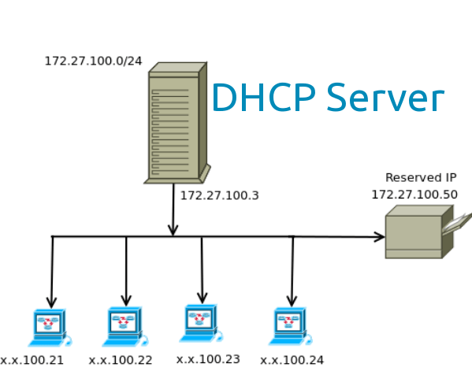
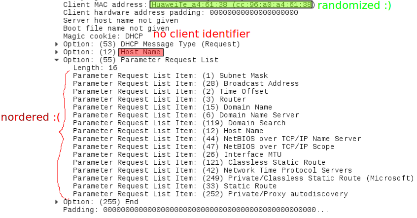

dhcpcanon
=========

DHCP client disclosing less identifying information.

https://github.com/dhcpap

PrototypeFund demo day, Berlin, 31st August 2017

----  ----

What is DHCP
=============

----

Dynamic Host Configuration Protocol (DHCP)
-------------------------------------------
- network protocol to get IP addresses and networking parameters automatically
- transparent to the end user
- user interact with a network manager

----

Local network image
---------------------

----

DHCP session
--------------

<!-- .element:  style="width: 30%; float:left" -->

1. my laptop: can i have an address?<!-- .element: class="fragment" data-fragment-index="0" -->
2. server:    i can offer you 192.168.1.23<!-- .element: class="fragment" data-fragment-index="1" -->
3. my laptop: i request 192.168.1.23<!-- .element: class="fragment" data-fragment-index="2" -->
4. server:    assigned to you!<!-- .element: class="fragment" data-fragment-index="3" -->

----

DHCP session, detailed
-----------------------

1. my laptop: can i have an address?<!-- .element: class="fragment" data-fragment-index="0" -->
  * btw my laptop name is juga_laptop<!-- .element: class="fragment" data-fragment-index="1" -->
  * it's a Dell i bought in Copenhague in 2013<!-- .element: class="fragment" data-fragment-index="2" -->
  * i use Debian with dhclient version 4.3.5<!-- .element: class="fragment" data-fragment-index="3" -->
  * i like the coffee with milk<!-- .element: class="fragment" data-fragment-index="4" -->
2. server:    i can offer you 192.168.1.23<!-- .element: class="fragment" data-fragment-index="5" -->
  * btw, you can find milk in the fridge<!-- .element: class="fragment" data-fragment-index="6" -->

----  ----

Issues with DHCP
=================

- reveal identifying information
- new standard to minimize it (RFC 7844)
- only a Windows 10 implementation

<!-- .element:  style="width: 40%;" -->

----  ----

What I had before
==================

<!-- .element:  style="width: 40%;" -->

- ``dhcpcanon``:
  a prototype Python DHCP client implementing part of the protocol
- ideas on how to further develop it

----  ----

Achieved
=========

----

``dhcpcanon``
---------------
- decisions on what and how to implement:
  follow Windows 10 implementation instead of restricted version of RFC 7844
- complete the protocol
- automatic testing
- improve documentation
- Debian package
- contact with different Linux distributions to test it

----

Example Windows 10 capture
---------------------------

----

Example ``dhclient`` capture
------------------------------

----

``systemd`` (system manager)
-----------------------------

- modified DHCP client code to enable Anonymity Profiles
- code in the process of being merge by ``systemd`` team

----

``Gnome Network Manager`` (network manager)
---------------------------------------------

Developing a proper integration in process

----

``dhcpcfp``
------------

A network scanner to show:
- which is the identifying information can be found
- how is different to the Anonymity profiles
- how operating system, device and/or person can be guessed

----

Internet Engineering Task Force meeting
------------------------------------------
<!-- .element:  style="width: 20%;" -->

[IETF](https://ietf.org/meeting/99/index.html)
- suggestions from the main author of the RFC 7844

----

Bornhack hacker camp
----------------------
<!-- .element:  style="width: 40%;" -->

[Bornhack](https://bornhack.dk/bornhack-2017/program/#/event/get-ip-addresses-without-leaking-identifying-information)  
- presentation: feedback and interesting ideas
- workshop: catch bugs

----

Linux distribution communities
---------------------------------

Interest on integrating ``dhcpcanon``: Debian, Tails, Subgraph, Gentoo, Archlinux

<!-- .element:  style="width: 10%;" -->
 <!-- .element:  style="width: 20%;" -->
 <!-- .element:  style="width: 20%;" --> <!-- .element:  style="width: 10%;" -->
 <!-- .element:  style="width: 20%;" -->

----  ----

Learned
=====================

----

Worth to remember
-----------------
- *release early, release often*
- *divide and conquer* (on tasks)
- is fun and productive to work with others
- challenging to explain technical concepts to non technical users

----

New
------

- present earlier to get feedback and bug reports earlier
- strategies to develop awareness (thanks marketing coaching!!)

----

IETF community
---------------

- worldwide open standards organization
- anyone can participate
- though difficult without funding nor corporate sponsor
- *rough consensus and working code*

----

Internet protocols development
---------------------------------

- political and historical reasons
- how the need for the Anonymity Profiles actually happens

<!-- .element:  style="width: 20%;" -->

----

DHCP fingerprint databases
----------------------------

----  ----

Did not work as planned
==============================

- planning :(
- the protocol and integration with operating systems
  can be more complex than i knew or expected

----  ----

What is next
=============

----

dhcpcanon, systemd
---------------------

- more people to test it to be ready for end users
- further development (IPv6)
- further operating systems compatibility (WIP)
- further documentation

----

Others
-------

- domain and Web page to facilitate finding documentation (WIP)
- final report
- more presentations and/or worshops
- Raspberry Pi image for demonstration purposes

<!-- .element:  style="width: 150px;" -->

----

Other operating systems implementations
----------------------------------------

<!-- .element:  style="width: 150px;" -->
 
 

Android, FreeBSD, Mac OS, iOS...

----  ----

Thank you very much!
======================

Many people for their very valuable ideas and suggestions.

Excelent PrototypeFund team :-)

<!-- .element:  style="width: 10%;" -->
 <!-- .element:  style="width: 10%;" -->

----  ----

Contact
==========

juga at riseup dot net

2DA8 1D01 455C 3A00 3219  8850 F305 447A F806 D46B

IRC: #dhcpcanon at havana.baconsvin.org:6697
